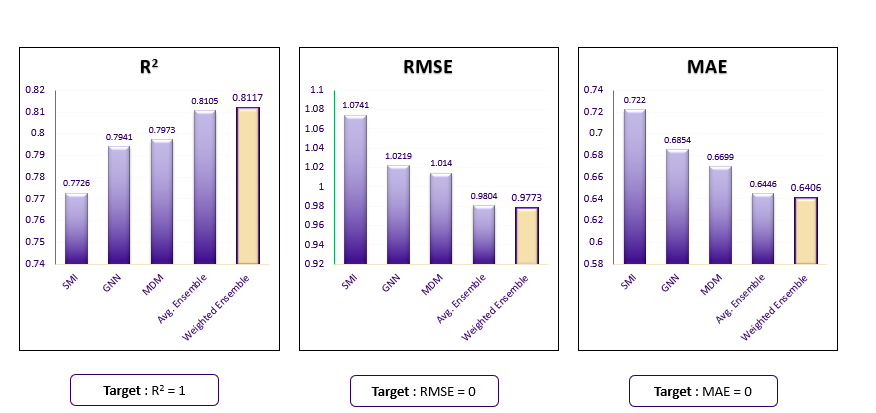

# Solvation Meta Predictor

This repository contains code for predicting the aqueous solubility of organic molecules using machine learning models. The models and dataset are based on the research paper: [Predicting Aqueous Solubility of Organic Molecules Using Deep Learning Models with Varied Molecular Representations](https://pubs.acs.org/doi/full/10.1021/acsomega.2c00642).


## Usage

1. **Pull Original Code** 
  - Pull the pnnlsolpaper folder from the original repository:
```sh
# pull the original PNNL codebase
git submodule init
git submodule update
```
- Then apply the patch set:
```sh
bash apply_patches.bash
```

2. **Download Data**: Download the dataset `dataset.csv` from [this link](https://figshare.com/s/542fb80e65742746603c) and save it as `data.csv` in the `./data` folder.

3. **Generate Features**:
    - Generate Pybel coordinates and Molecular Dynamics (MDM) features by running `create_data.py` in the `./data` folder:
      ```sh
      cd ./pnnlsolpaper/data
      python create_data.py
      ```
    - Then return to the root folder
      ```sh
      cd ../..
      ```

4. **Train Models**:
    - To train the MDM model, run `pnnlsolpaper/mdm/train.py` as a package (command written assuming the root directory):
      ```sh
      python -m pnnlsol.mdm.train
      ```
    - To train the GNN model, run `pnnlsolpaper/gnn/train.py`:
      ```sh
      python -m pnnlsol.gnn.train
      ```
    - To train the SMI model, run `pnnlsolpaper/smi/train.py`:
      ```sh
      python -m pnnlsol.smi.train
      ```

5. **Make Predictions**:
    <br>(NOTE: this step is optional)
    - Use the `predict.ipynb` files in each model's folder to make predictions (note: this step is optional):
      ```sh
      cd pnnlsolpaper/mdm/
      jupyter notebook predict.ipynb
      ```
      Repeat the above steps for the `gnn` and `smi` folders.
    - Afterwards return to the root directory:
      ```sh
      cd ../..
      ```

6. **Ensemble Models**:
    - To ensemble the models, run the following scripts from the ensemble folder:
      ```sh
      cd ensemble/
      python CV.py
      python Optuna.py
      python KNN.py
      ```

7. **Compare Predictions**:
    - To compare predictions from individual models with ensemble methods, use the `ensemble_prediction.ipynb` notebook:
      ```sh
      jupyter notebook ensemble_prediction.ipynb
      ```
## Solvation Meta Predictor Perfomacne


## Additional Information
For detailed instructions on how to run the models, featurize the data, and other specifics, please refer to the original research paper linked above. The methods and techniques described in the paper are critical for understanding and effectively using this repository.
